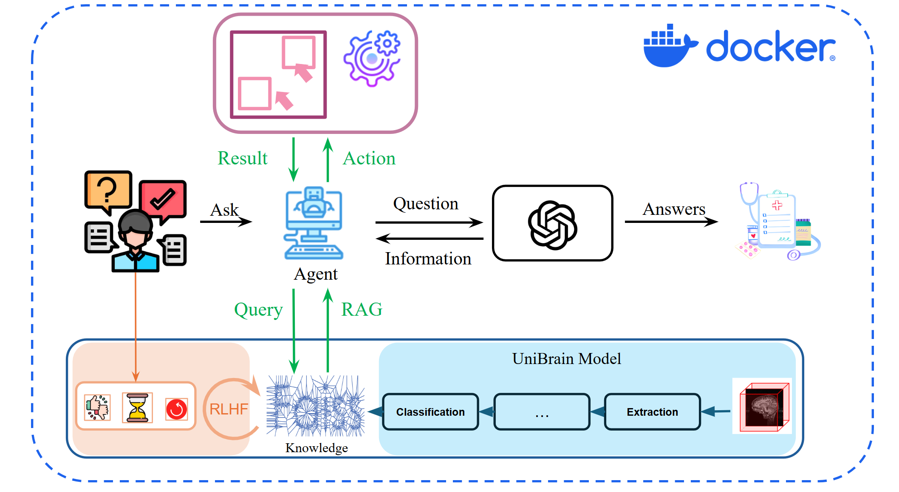

## Advanced Usage

## Architecture

A high-level view of the UniBrain system, showing how the Agent Layer, RAG, memory, and RLHF components fit together to orchestrate the end-to-end pipeline.

## Key Components

### Agent Layer
Built with LangChain tools and agents, this layer:
- Translates natural-language commands into scripted tool calls  
- Collects execution logs  
- Generates diagnostic messages and visualizations  

### Retrieval-Augmented Generation (RAG)
- **Knowledge Stores:**  
  1. Natural-language documents (papers, API guides)  
  2. FAISS vector database (code snippets, examples)  
- Agent retrieves relevant entries before crafting responses or code.

### Long-Term Memory
Embeds and stores extended conversation history in the FAISS vector DB for context recall when needed.

### RLHF Preference Learning
Collects four user feedback signals: `like`, `dislike`, `reading_time`, `regenerate`.  
Each turn builds a preference vector \(p_t\), and updates parameters \(\theta\) via:

\[
\theta \leftarrow \theta + \eta\,\nabla_{\theta}\,\mathbb{E}_{t}[\,r(p_t)\,], 
\quad
r(p_t)=\alpha\,\textsf{like}-\beta\,\textsf{dislike}+\gamma\log(1+\textsf{reading\_time})-\delta\,\textsf{regenerate}.
\]

---

### ✨ Key Features

| UI / UX                         | Details                                                                                       |
| ------------------------------ | --------------------------------------------------------------------------------------------- |
| **Drag & Drop NIfTI**          | Upload `.nii` / `.nii.gz` files via drag-&-drop—stored under `uploads/<8-char-id>/` for easy cleanup. |
| **Smart Reruns**               | Uploaded data persists across Streamlit reruns—viewers and cards never vanish on refresh.     |
| **Collapsible Output Cards**   | Keep your workspace tidy—expand only the results you need.                                     |
| **2D ↔ 3D Switch**             | Toggle between a fast slice-slider or a Plotly volume render (with quality slider & colour map). |
| **Adjacency Exploration**      | Inspect connectivity via heat-map or interactive network graph (edge-density slider).          |
| **Download Everywhere**        | Export NIfTI (`.nii.gz`) or raw PyTorch tensors (`.pt`) at each stage.                         |
| **Sidebar “⚙️ Pipeline steps”** | Tick/untick Extraction, Registration, Parcellation, Network Analysis, etc., before running.   |
| **Natural-Language Controller**| Commands like `skip segmentation`, `reset steps`, `enable classification`.                     |
| **Chat Assistant**             | GPT-4o-mini by default—answers neuroscience queries via RAG and can invoke `run_unibrain_inference`. |

---

### 🏗️ Project Layout

```

UniBrainAssistant/
├─ app.py                      ← Streamlit entrypoint (self-contained)
├─ assets/
│  ├─ tpl\_img.npy              ← template volume
│  ├─ tpl\_gm.npy               ← template gray-matter mask
│  └─ tpl\_aal.npy              ← template AAL labels
├─ model.py                    ← UniBrain graph-neural network module
├─ prompts/
│  └─ unibrain\_system\_prompt.md
├─ unibrain.pdf                ← paper for RAG retrieval
└─ extra\_knowledge.txt         ← supplementary text corpus for RAG

```

---

### 🔬 Method Structure

<p align="center">
  
</p>

> **No UniBrain weights?**  
> If `assets/unibrain.pth` is missing, the app loads a dummy stub so you can still explore the UI.
