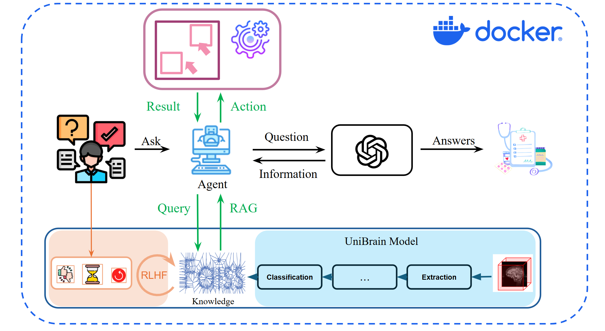
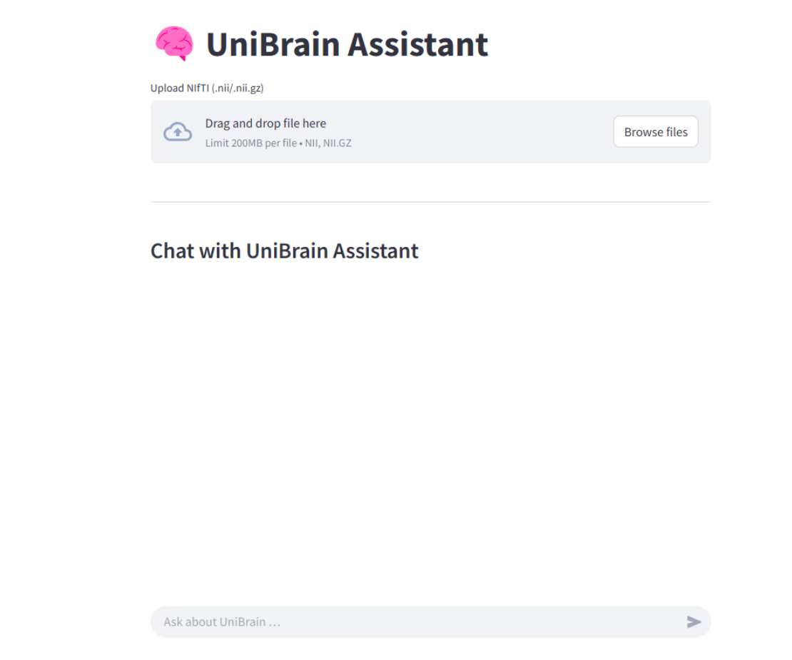
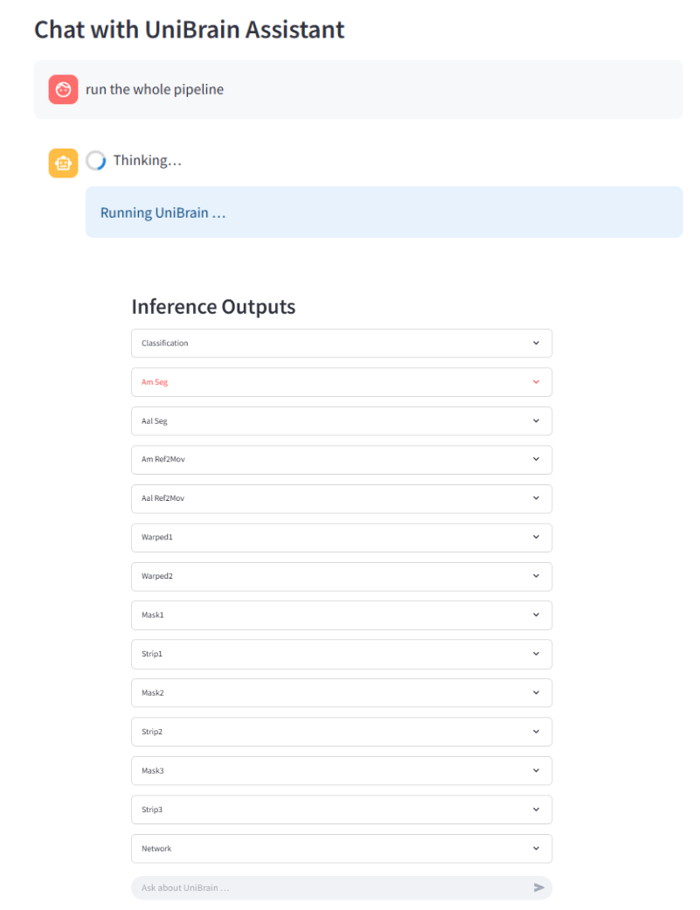
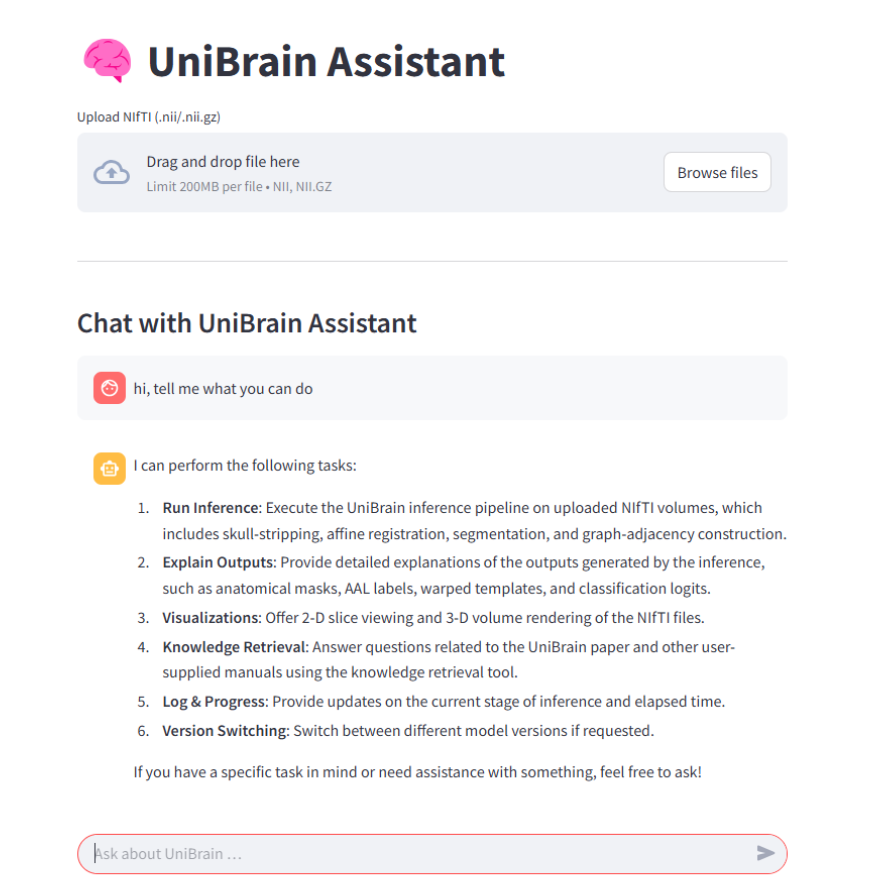
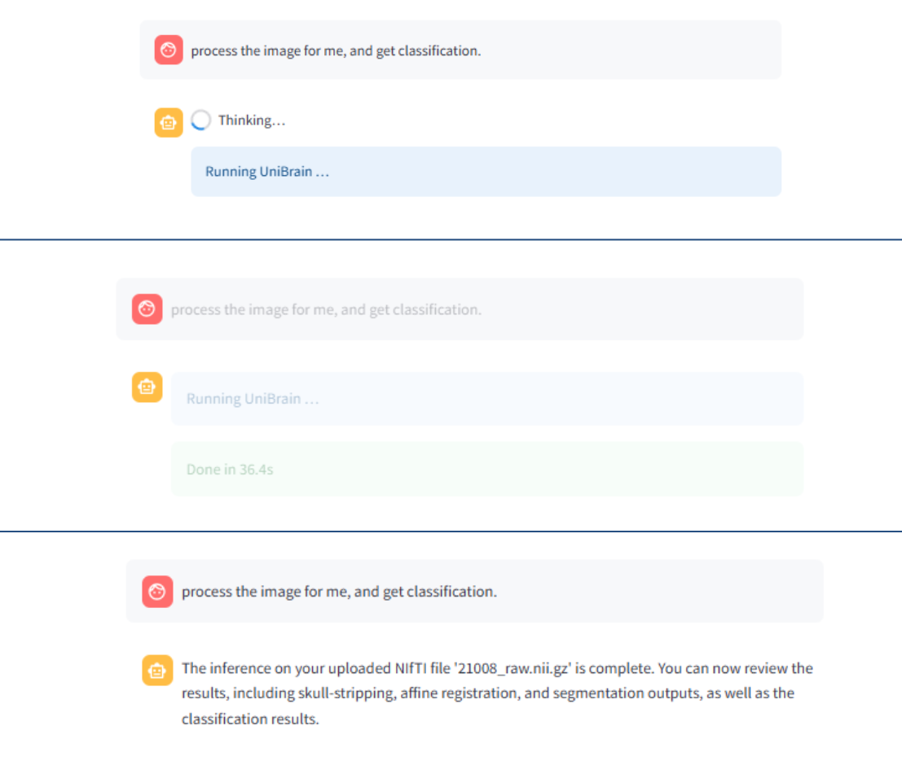

### 🚀 Try Me – One Click, Done Quick!

You can drop in a NIfTI file, watch every preprocessing step unfold in real time, explore the resulting connectome interactively, and ask questions in plain English or any natural language — all without leaving your web browser.

It pairs Streamlit’s reactive UI with LangChain’s tool-calling so you can **see**, **tweak**, and **interrogate** each stage of the pipeline:

- skull-stripping → affine registration → tissue segmentation → AAL parcellation → graph construction → disease classification  
- fully **interactive**: 2D slice viewer, 3D Plotly volume, heat-map / graph visualizations, one-click downloads  
- **pipeline orchestration by natural-language** – e.g. `run the pipeline without segmentation`, `enable network`  
- **RAG-powered Q & A** over both your outputs **and** the UniBrain paper itself

### ⏳ We are working hard to enhance the tool, and a new version will be released soon.

---



A schematic overview of the UniBrain processing pipeline, illustrating the end-to-end workflow from input neuroimaging data (NIfTI/DICOM) through segmentation, registration, parcellation, network analysis, and final interactive chat-based querying.

---

## 🚀 Quick Start (Self-Deployment)

```bash
git clone https://github.com/soz223/UniBrainAssistant.git
cd UniBrainAssistant
python3 -m venv .venv && source .venv/bin/activate      # optional
pip install -r requirements.txt
export OPENAI_API_KEY="sk-..."                         # for LLM chat & RAG
streamlit run app.py
````

Open [http://localhost:8501](http://localhost:8501/) → upload a NIfTI (or DICOM) → pick processing steps → **Run**.
Then interact with your scan:

```
❯ skip segmentation             # run without the Segmentation step
❯ what does a high dice score mean?
❯ show only the network analysis stage
```

---

## 🔑 Environment Variables

| Var              | Purpose                                                 |
| ---------------- | ------------------------------------------------------- |
| `OPENAI_API_KEY` | Required for chat, command-parser LLM, and RAG          |
| `IMG_SIZE`       | (optional) override default 96³ voxel input size        |
| `ATLAS`          | (optional) specify brain atlas (e.g., “Desikan”, “AAL”) |

---

## 📦 Core Dependencies

* **UI & Workflow:** `streamlit ≥1.32`
* **Imaging & ML:** `torch`, `numpy`, `nibabel`, `SimpleITK`, `plotly`, `networkx`
* **LLM & RAG:** `langchain`, `langchain-openai`, `faiss-cpu`, `openai (≥1.0)`

See `requirements.txt` for exact version pins.

---

## 🤖 Command Grammar (for reference)

| Intent           | Examples (case-insensitive)                                        |
| ---------------- | ------------------------------------------------------------------ |
| **Skip step**    | `skip segmentation`, `no parcellation`, `without network`          |
| **Enable step**  | `enable analysis`, `turn on registration`, `enable classification` |
| **Reset**        | `reset steps`, `reset pipeline`                                    |
| **General chat** | anything else → routed to the UniBrain chat assistant              |

**Processing flow:**

1. **Regex fast-path**
2. if unresolved → **GPT-4o-mini** (`CMD_SYS_PROMPT`) → JSON command


---

## 🌐 Try the Demo Website

1. Visit the live demo at [Ongoing Website](https://unibrain-assistant.demo)
2. Enter your `OPENAI_API_KEY` in the sidebar API key field
3. Upload a `.nii` or `.nii.gz` file
4. Use the sidebar menu to enable/disable steps, then click **Run**
5. Chat with your data right in the browser:

   ```
   ❯ What can you do?
   ❯ Run the whole pipeline on the uploaded image
   ❯ Skip segmentation and do the whole preprocessing
   ❯ How does parcellation work?
   ```

## 🖼️ Demo

<p align="center">



</p>
<p align="center">


</p>
